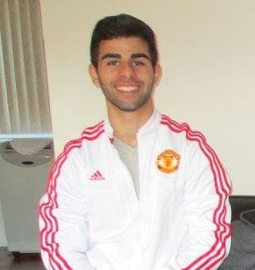

# WELCOME TO FANTASY FIVE

## What is Fantasy Five

#### Fantasy Five is, currently a prototype of, a sandbow that allows users to practice trading cryptocurrencies with no real financial risk. Fantasy Five allows users to access historical OHLCV data on several cryptocurrencies, view machine learning prediciton plots, as well as to create and view mock portfolios. 

#### Fantasy Five currently has information and analysis on 12 cryptocurrencies, four in each of the following categories: High Cap(>$5b), Mid Cap(251m-4.99b), Low Cap (<250m) and utilizes the SVC and ADABoost classifiers for its machine learning models and predictions.  

#### Through the portfolio tab, users are able to create mock cryptocurrency wallets choosing how much they would like to invest, in which coins to invest in, and what allocation per selected coin.

## Inspiration
#### The inspiration behind Fantasy Five stems from the amount of attention currently being paid to the crypto space. Our team sought to create an environment where people interested in the crypto space, whether experienced or just starting out, can practice buying, selling, and navigating through the rapidly advancing industry. 

## The Team:

### Michael Bejan 
##### [LinkedIN] (https://www.linkedin.com/in/michael-bejan-b52496109/)
##### [GitHub] (https://github.com/mbejan325)
##### [Email] (mbejan@scu.edu)

### Jason Garcia 
##### [LinkedIN] ()
##### [GitHub] (https://github.com/jasonjgarcia24)
##### [Email] (jason.garcia24@gmail.com)

### Srini Goda
##### [LinkedIN] ()
##### [GitHub] (https://github.com/sngoda)
##### [Email] (sngoda@hotmail.com)

### Saeed Raghib
##### [LinkedIN] (www.linkedin.com/in/saeedraghib)
##### [GitHub] (https://github.com/saeedraghib)
##### [Email] (saeed_raghib@msn.com)