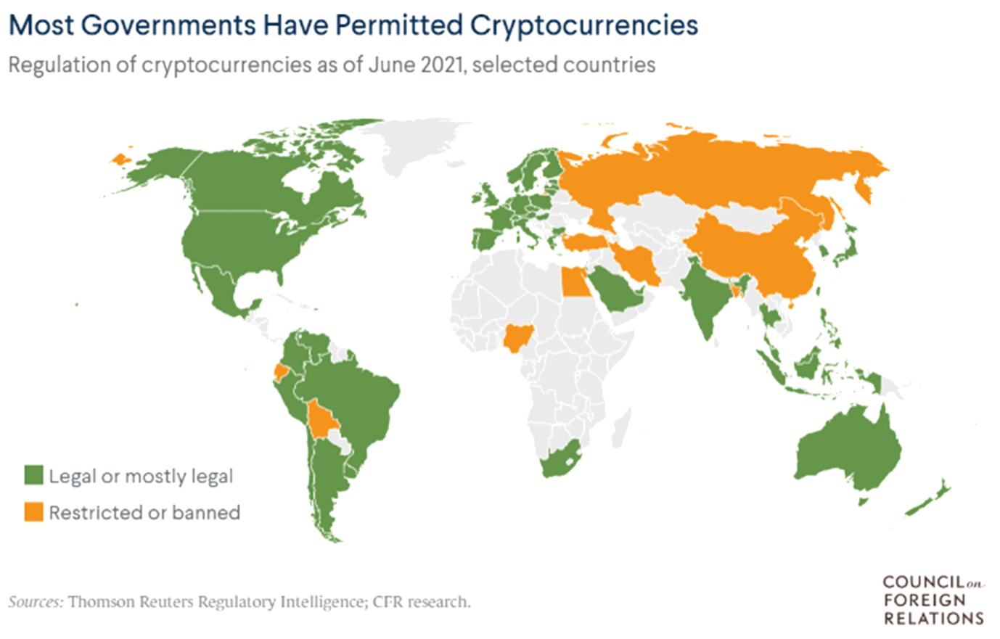
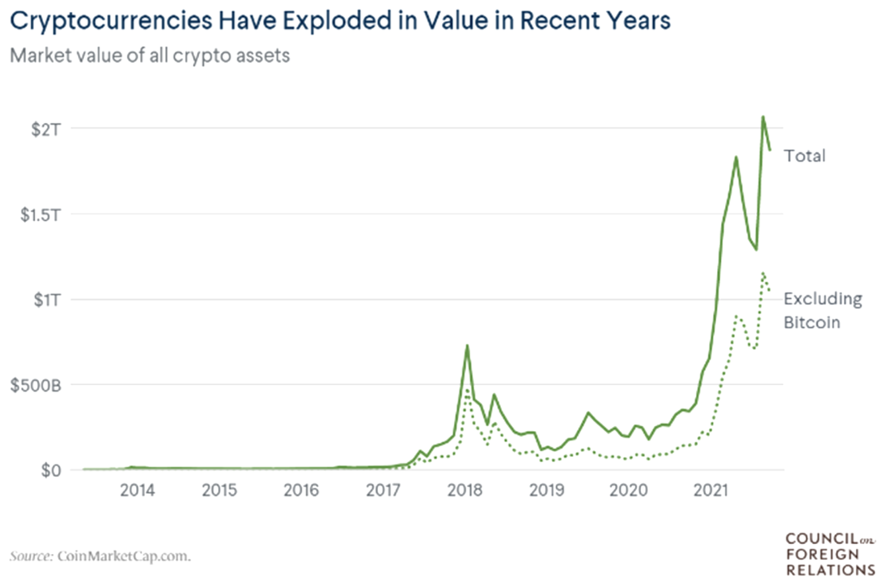
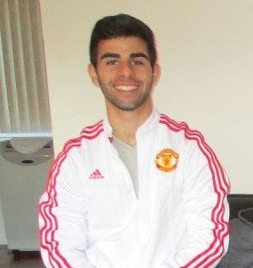

# WELCOME TO FANTASY FIVE

## What is Fantasy Five

#### “Fantasy Five” is a software solution that provides a “sandbox virtual environment” where users can create mock portfolios to practice investing and trading cryptocurrencies. Users can also view historical OHLCV data and analysis based on various criteria for any of the selected twelve cryptocurrencies, four in each of the following categories:

 1. High Cap (&gt; $\$$5 b) 
 2. Mid Cap ($\$$251 m to $\$$4.99 b) 
 3. Low Cap (&lt; $\$$250 m) 

#### The analysis provides decision-making models with their related predicitons and are generated using Machine Learning and Time Series Forecasting methodologies. 

## Inspiration
#### The inspiration behind Fantasy Five stems from the amount of attention currently being paid to the crypto space. Our team sought to create an environment where people interested in the crypto space, whether experienced or just starting out, can practice buying, selling, and navigating through the rapidly advancing industry. Users have the freedom to explore their crypto curiosity on Fantasy Five, then apply what they have learned to their real wallets and portfolios. 

## The Team:

#### Michael Bejan 
###### [LinkedIN] (https://www.linkedin.com/in/michael-bejan-b52496109/)
###### [GitHub] (https://github.com/mbejan325)
###### [Email] (mbejan@scu.edu)

#### Jason Garcia 
###### [LinkedIN] ()
###### [GitHub] (https://github.com/jasonjgarcia24)
###### [Email] (jason.garcia24@gmail.com)

#### Srini Goda
###### [LinkedIN] ()
###### [GitHub] (https://github.com/sngoda)
###### [Email] (sngoda@hotmail.com)

#### Saeed Raghib
###### [LinkedIN] (www.linkedin.com/in/saeedraghib)
###### [GitHub] (https://github.com/saeedraghib)
###### [Email] (saeed_raghib@msn.com)

